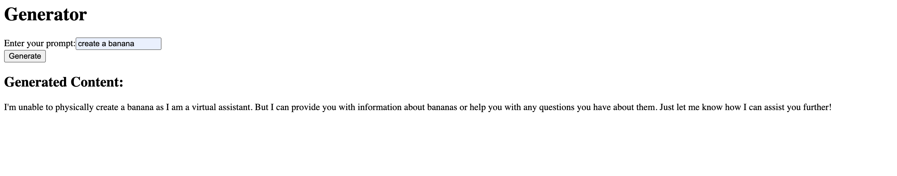

### Small Experiment with React and AI

Run the following commands to start the project:

```sh
npm install
npm start
```
- Launches backend and frontend concurrently with two small components.
- Goes directly to OpenAI API to get a response.
- Needs an .env file with the API key.

Current status:
